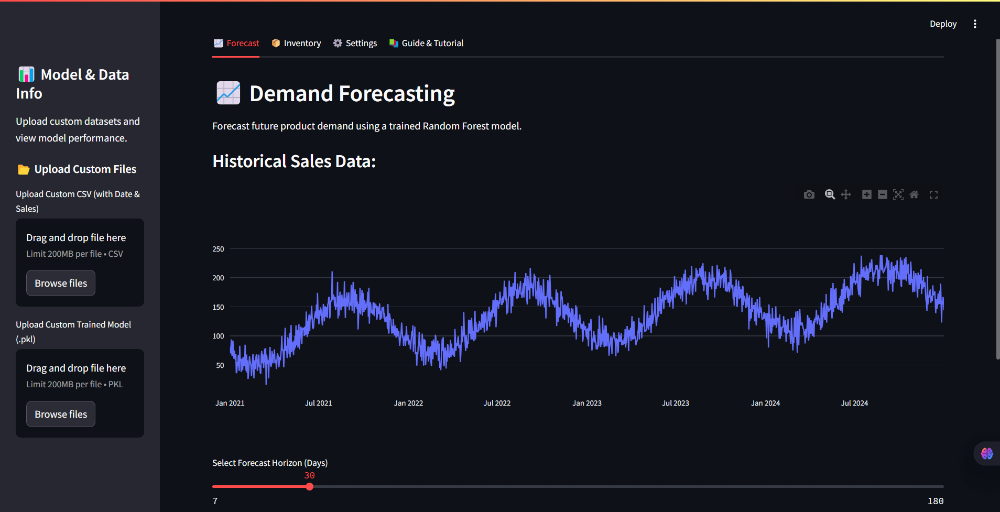

# 🧠 Demand Forecasting & Inventory Optimization App

> **A Streamlit-based machine learning tool to predict demand and optimize inventory decisions in a seasonal sales environment.**



## [Visit the App Live on Streamlit Cloud](https://mrraihan29-demand-forecasting.streamlit.app)

## 📌 Table of Contents

- [🧠 Demand Forecasting \& Inventory Optimization App](#-demand-forecasting--inventory-optimization-app)
  - [Visit the App Live on Streamlit Cloud](#visit-the-app-live-on-streamlit-cloud)
  - [📌 Table of Contents](#-table-of-contents)
  - [1. 📖 Overview](#1--overview)
  - [2. ✨ Features](#2--features)
  - [3. 🚀 Getting Started](#3--getting-started)
    - [Prerequisites](#prerequisites)
    - [Installation](#installation)
    - [Run Notebooks to Generate Data \& Train Model](#run-notebooks-to-generate-data--train-model)
    - [Running the App](#running-the-app)
  - [4. 📁 Project Structure](#4--project-structure)
  - [5. 🧪 Methodology](#5--methodology)
    - [Synthetic Data Generation](#synthetic-data-generation)
    - [Feature Engineering](#feature-engineering)
    - [Forecasting Model](#forecasting-model)
    - [Inventory Optimization](#inventory-optimization)
  - [6. 📉 Performance Metrics](#6--performance-metrics)
  - [7. 🧭 In-App Guide](#7--in-app-guide)
  - [8. 🔮 Future Work](#8--future-work)
  - [9. 👤 Contact](#9--contact)

---

## 1. 📖 Overview

This web app provides a complete pipeline for **forecasting demand** and **optimizing inventory** using time-series sales data. It's built for demonstration, educational, and practical use cases in supply chain and operations management.

Users can either upload their own data or use a built-in synthetic dataset to explore demand forecasting and compute optimal inventory metrics such as:

- Reorder Point (ROP)
- Safety Stock
- Optimal Order Quantity

The app uses a **Random Forest Regressor** to forecast future demand, and classic inventory control formulas to determine ordering strategy based on user-defined business parameters.

---

## 2. ✨ Features

- 📊 **Forecasting with Machine Learning:** Predict future daily sales using a Random Forest model.
- 🔧 **Synthetic or Custom Data:** Use provided synthetic data or upload your own.
- 🧮 **Inventory Optimization:**

  - Calculate **Safety Stock**, **ROP**, and **Order Quantity**
  - Adjustable lead time, service level, replenishment frequency, and current stock

- 📈 **Interactive Visualizations:** Built with Plotly for dynamic charts and insights.
- 🔍 **In-App Guide & Methodology:** Easily understand how calculations and models work.
- 🧠 **Feature-Rich ML Pipeline:** Includes lag features, date features, and recursive predictions.

---

## 3. 🚀 Getting Started

### Prerequisites

- Python 3.8 or above
- `pip`
- (Optional) `virtualenv` or `venv`

### Installation

```bash
# Clone the repository
git clone https://github.com/[YourUsername]/inventory-optimization-streamlit.git
cd inventory-optimization-streamlit

# Create and activate virtual environment (recommended)
python -m venv venv
# Windows
venv\Scripts\activate
# macOS/Linux
source venv/bin/activate

# Install required packages
pip install -r requirements.txt
```

### Run Notebooks to Generate Data & Train Model

```bash
# Launch Jupyter
jupyter notebook
```

Then execute the following notebooks in order:

1. `01_data_generation_eda.ipynb` → generates synthetic sales data
2. `02_model_training.ipynb` → trains and saves the model (`models/random_forest_forecasting_model.pkl`)

### Running the App

```bash
streamlit run app.py
```

Visit `http://localhost:8501` in your browser.

---

## 4. 📁 Project Structure

```bash
inventory-optimization-streamlit/
├── app.py                     # Main Streamlit app
├── data/
│   ├── raw/                   # Synthetic generated sales data
│   └── processed/             # Reserved for future use
├── models/                    # Trained ML model
├── notebooks/                 # Jupyter notebooks for dev
│   ├── 01_data_generation_eda.ipynb
│   ├── 02_model_training.ipynb
│   └── 03_streamlit_app_dev.ipynb
├── src/                       # Custom utility functions/modules
├── .streamlit/                # UI config for Streamlit
├── requirements.txt
├── LICENSE
└── README.md
```

---

## 5. 🧪 Methodology

### Synthetic Data Generation

Sales are simulated over four years (2021–2024), incorporating:

- 🔼 A linear upward trend
- 🔄 Annual seasonality (sine wave)
- 📉 Random noise
- ✅ No negative values

Mathematically:

> **Yₜ = Tₜ + Sₜ + Rₜ**
> Where:

- **Tₜ**: Trend
- **Sₜ**: Seasonality
- **Rₜ**: Residual noise

### Feature Engineering

Key features added to improve model learning:

- Date features: `year`, `month`, `day_of_week`, `quarter`, etc.
- Lagged values: `Sales_Lag_1`, `Sales_Lag_7`, `Sales_Lag_365`

These enable the model to learn time-dependent structures.

### Forecasting Model

- **Model**: `RandomForestRegressor` (from scikit-learn)
- **Forecasting strategy**: Recursive multi-step prediction
- **Why RF?** Easy to interpret, robust, and handles complex relationships well

### Inventory Optimization

Inventory parameters are calculated using forecasted demand:

- **Safety Stock (SS):**

  $$SS = Z \cdot RMSE \cdot \sqrt{\text{Lead Time}}$$

- **Reorder Point (ROP):**

  $$ROP = (\bar{D} \cdot LT) + SS$$
  Where:

  - $\bar{D}$ is average forecasted daily demand
  - LT is lead time in days

- **Order Quantity (Q):**

  $$Q = \sum D_{\text{replenishment}}$$
  Sum of forecasted demand over the replenishment period.

---

## 6. 📉 Performance Metrics

Evaluated on unseen test data (year 2024):

| Metric                         | Value |
| ------------------------------ | ----- |
| Mean Absolute Error (MAE)      | 17.07 |
| Root Mean Squared Error (RMSE) | 20.83 |
| R² Score                       | 0.74  |

> **Interpretation:** The model explains 74% of the variation in sales and maintains reasonable accuracy for short-term demand forecasting.

---

## 7. 🧭 In-App Guide

For an interactive walkthrough of the app’s purpose, calculations, and how to use it, visit the **📚 "Guide & Tutorial"** tab inside the Streamlit app.

---

## 8. 🔮 Future Work

- 🤖 **Model Improvements:** Incorporate Prophet, ARIMA, or LSTM; add prediction intervals
- 📦 **Multi-SKU Support:** Handle multiple products and categories
- 📊 **Cost-Aware Inventory Models:** Include holding, stockout, and ordering costs
- 🔌 **Deployment:** Docker containerization, CI/CD, and cloud-based hosting
- 🌍 **External Data:** Add holidays, weather, or promotional effects to boost prediction accuracy

---

## 9. 👤 Contact

**Muhammad Rizky Raihan**
[GitHub](https://github.com/mrraihan29)
[LinkedIn](https://linkedin.com/in/mrraihan)
